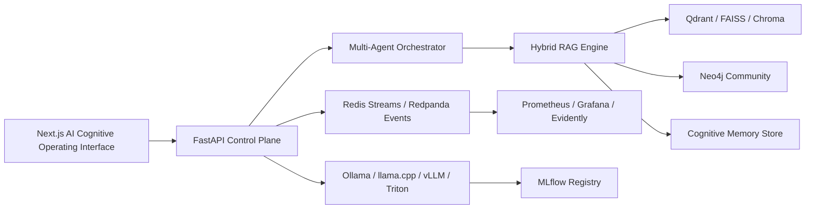

# AetherMind Architecture

## Core Planes

Control plane: FastAPI coordinates auth, RBAC, API routing, workflows, WebSocket telemetry, and audit logging.

Reasoning plane: agents plan, retrieve, debate, reflect, execute tools, and monitor their own confidence.

Memory plane: semantic, episodic, temporal, and graph memories are scored by relevance, importance, recency, and reinforcement.

Model plane: local open-source models are served through Ollama for student machines, llama.cpp for quantized CPU fallback, and vLLM/Triton for GPU throughput.

Observability plane: Prometheus metrics, Grafana dashboards, OpenTelemetry traces, and Evidently AI drift reports measure model and platform quality.

## Scaling Strategy

- Horizontal scale the FastAPI control plane behind Kubernetes services.
- Place model serving on GPU nodes and route requests by task class and latency budget.
- Use Qdrant shards for vector growth and Neo4j read replicas for graph-heavy traversals.
- Move event traffic from Redis Streams to Redpanda/Kafka when throughput exceeds single-node limits.
- Cache retrieval results, prompt plans, and embeddings to reduce local GPU pressure.

